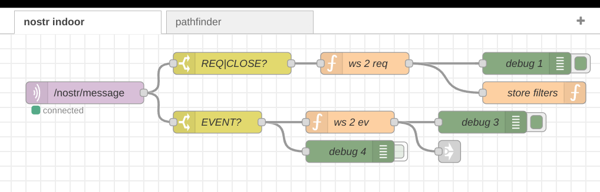
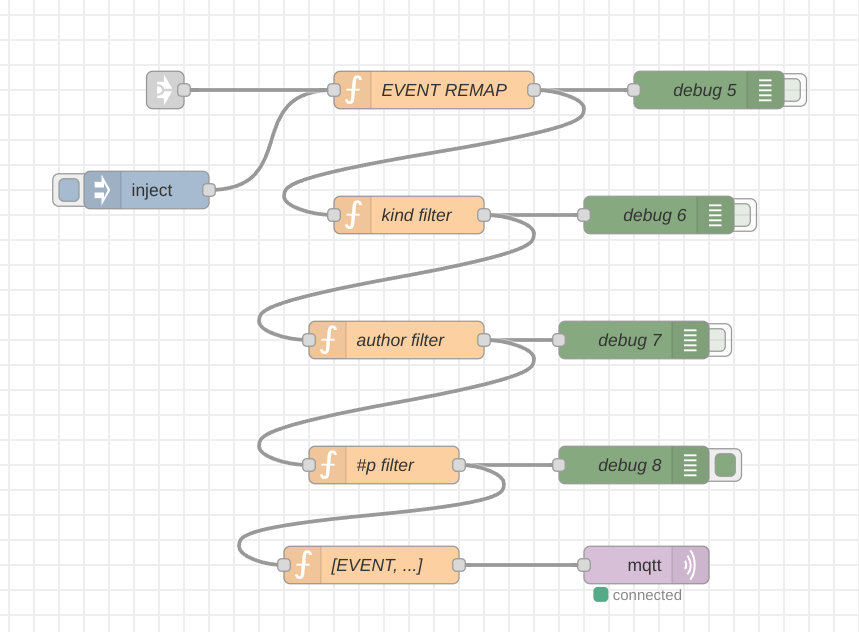
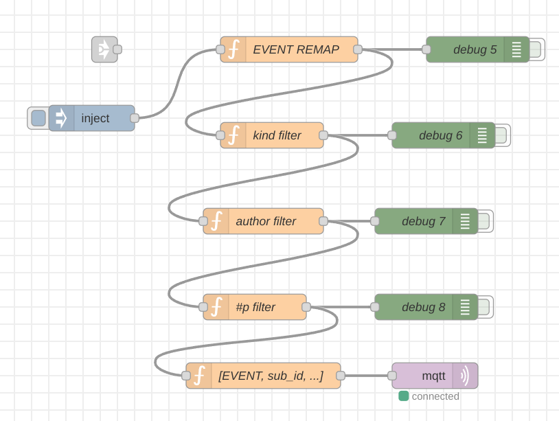

# nostr-relay-node
nostr relay-server adapter to mqtt written in simple nodejs

PoC v2 is working very well as a private note store or as a
basic funcional nostr-relay server.

Dependencies: 
* Eclipse Mosquitto (aka. MQTT)
* Redis Real-Time Database
* Node.js
* NODE-RED flow-based development tool

### 1st run wss relay [nostr] to mqtt [bridge]
https://github.com/tegila/nostr-relay-node/blob/master/wss.to.mqtt.bridge.js

> node wss.to.mqtt.bridge.js

### 2nd run mqtt [bridge] to redis [store]
https://github.com/tegila/nostr-relay-node/blob/master/mqtt.redis.nostr.relay.js

> node mqtt.redis.nostr.relay.js

### 3nd [OPTIONAL] run NODE-RED
> node-red

You're done!

TODO:
 - Nostr Live Routing

Done:
 - Nostr fast-yet-simple-store with redis
 - Study workspace using NODE-RED as a helper (fast-forwarder)
 - Live routing was done on node-red but disabled due to SPEED!!

# PoC v0 alfa

# mqtt side of nostr-server

# relay routing path finder

# updated to remove the routing (waiting to implement in js)

