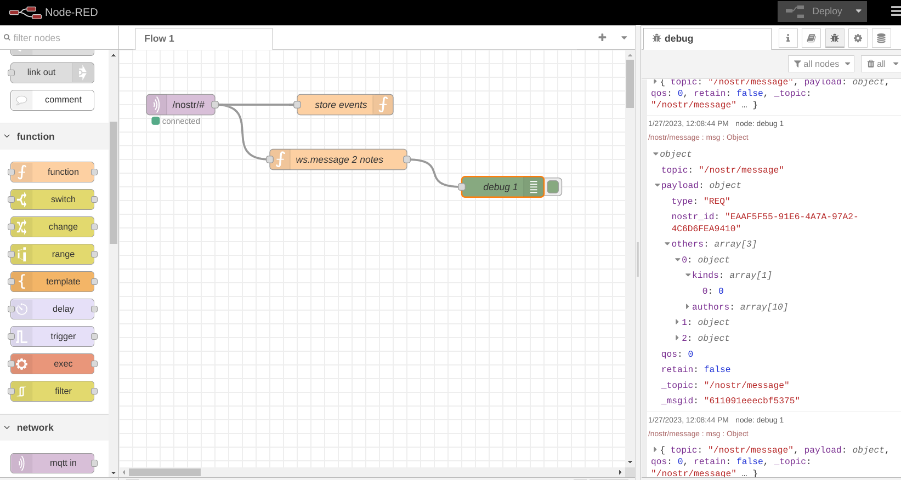

# nostr-relay-node
nostr relay-server adapter to mqtt written in simple nodejs

# PoC v0 alfa

# mqtt side of nostr-server

# relay routing path finder

# updated to remove the routing (waiting to implement in js)

